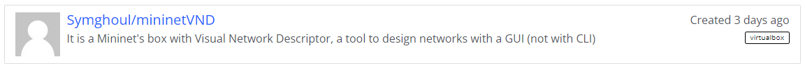
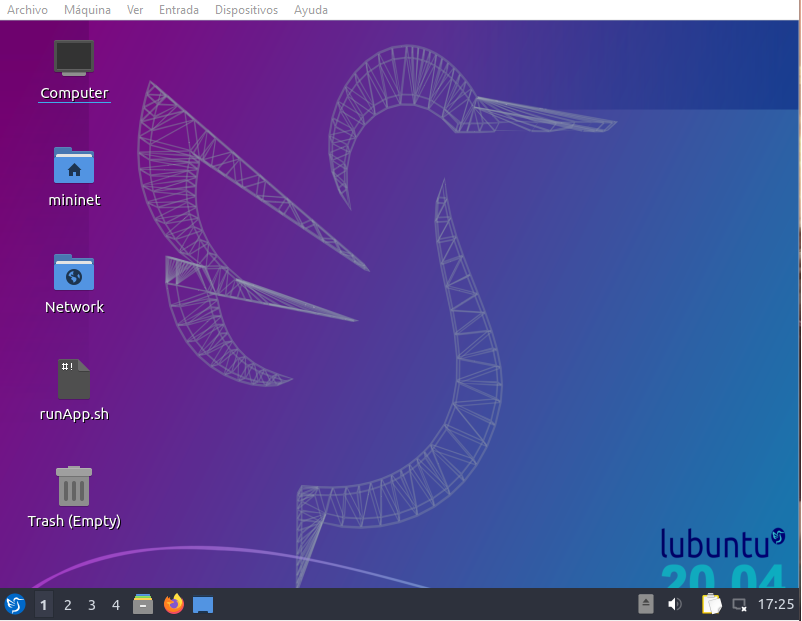
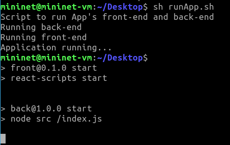

# Visual-descriptor #
A repository to work in a visual descriptor to the tool Mininet

## How to get this tool
**1.**  Download the _Vagrantfile_ at the **vagrant directory**

**2.** Open a _Terminal_ located at the vagrant directory

**3.** (Optional) Download the [Vagrant image](https://app.vagrantup.com/boxes/search?utf8=%E2%9C%93&sort=downloads&provider=&q=Symghoul).

if you had pre-downloaded the box, use this command, modifying "package.box" with the custom name if it is modified.
```sh
vagrant box add ./package.box --name Symghoul/mininetVND
```


**4.** (Optional) After that, you could modify the vagrantfile in the vagrant directory. as below (if it's needed)
```sh
config.vm.box = "Symghoul/mininetVND"
```

**5.** Finally, write this and wait until it ends, vagrant will open the proviosioner on this case VirtualBox (All is modifiable, read the vagrantfile's instructions) 
```sh
vagrant up
```

the credentials are
- **User**: mininet
- **password** : mininet



Once you are in, open a terminal on the desktop and execute the runApp.sh script 
```sh
sh runApp.sh
```


## How to use this tool ##
Read the User Guide Mininet doc

## Possibles errors ##
While you are designing your topology could be some problems saving the files, so, for that cases, export your topology and you will see that the terminal with mininet (the second terminal opened who starts with "adding X device" "adding (...)) will close abruptly (This is the main reason to recognize this error). Just **reload** the page and click on **File button** and click on **New** button and import your topology exported before. 

